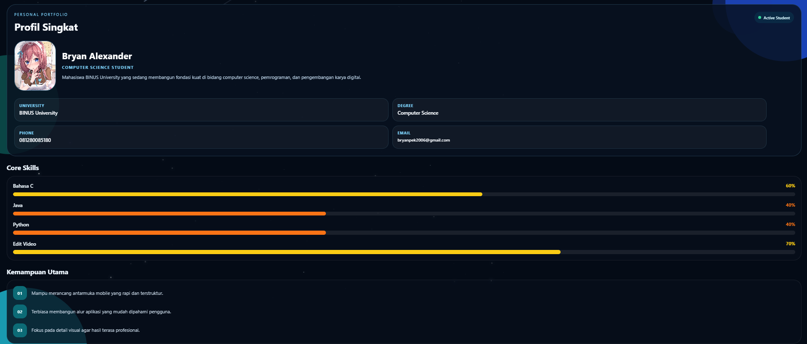
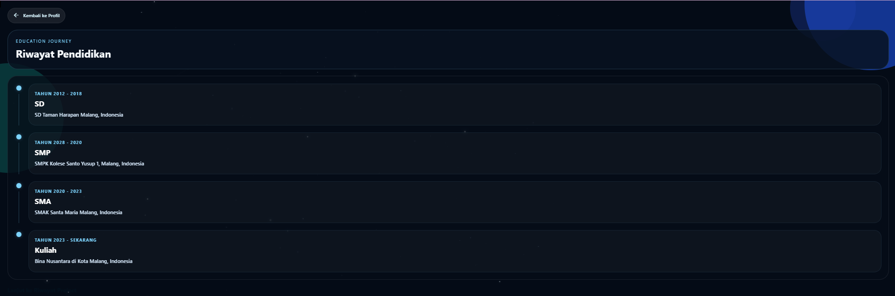
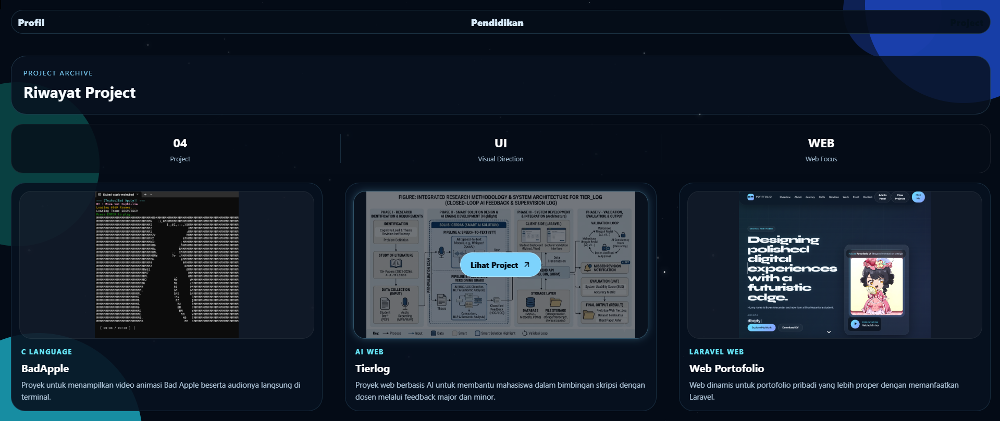

# Personal Portfolio App

Proyek ini adalah aplikasi portofolio pribadi sederhana yang dibuat dengan React Native menggunakan Expo dan Expo Router. Repo ini berisi 3 halaman utama:

- Halaman profil
- Halaman riwayat pendidikan
- Halaman riwayat project

Fokus utama project ini saat ini adalah implementasi teknis aplikasi dan struktur kontennya, sehingga README ini ditujukan sebagai dokumentasi singkat untuk setup dan pengembangan.

## Tech Stack

- React Native
- Expo
- Expo Router
- TypeScript
- Expo Image
- Expo Vector Icons

## Fitur Teknis

- File-based routing menggunakan Expo Router
- Multi-screen navigation
- Animated background dengan efek bintang, nebula, dan shooting star
- Scroll-based parallax background
- Interactive cards untuk education dan projects
- Responsive project grid untuk web dan mobile

## Struktur Folder

```text
app/
  _layout.tsx         Konfigurasi routing dan transisi screen
  index.tsx           Halaman profil
  education.tsx       Halaman riwayat pendidikan
  projects.tsx        Halaman riwayat project
  starBackground.tsx  Komponen background animasi

assets/
  images/
    Photo Profile.jpg
    portofolio/       Aset gambar project

app-example/          Folder bawaan template Expo, tidak dipakai untuk portfolio utama
```

## Cara Menjalankan Project

1. Clone repository

```bash
git clone <url-repository>
```

2. Install dependency

```bash
npm install
```

3. Jalankan project

```bash
npm run start
```

Atau jika ingin langsung membuka target tertentu:

```bash
npm run android
npm run ios
npm run web
```

## Requirement

Pastikan environment berikut sudah tersedia:

- Node.js
- npm
- Expo CLI environment via `npx expo`

Untuk menjalankan di device:

- Android Emulator atau Expo Go
- iOS Simulator jika menggunakan macOS
- Browser modern jika menjalankan mode web

## Routing

Project ini memakai Expo Router dengan struktur route berbasis file:

- `/` untuk halaman profil
- `/education` untuk halaman riwayat pendidikan
- `/projects` untuk halaman riwayat project

## Catatan Pengembangan

- Data konten saat ini masih hardcoded langsung di file screen.
- Gambar project disimpan di `assets/images/portofolio`.
- Background animasi digunakan ulang di semua halaman melalui komponen `app/starBackground.tsx`.
- Folder `app-example/` masih ada dari template awal dan tidak dipakai oleh flow utama portfolio ini.

## Screenshoot Tampilan Halaman



<br>



<br>



## Script yang Tersedia

```bash
npm run start
npm run android
npm run ios
npm run web
npm run lint
```

## Catatan Tambahan

- Jika ingin membersihkan repo dari sisa template, folder `app-example/` bisa dipisahkan atau dihapus nanti.
- Jika ingin membuat project ini lebih production-ready, data konten bisa dipindahkan ke file konfigurasi terpisah atau backend/API.
